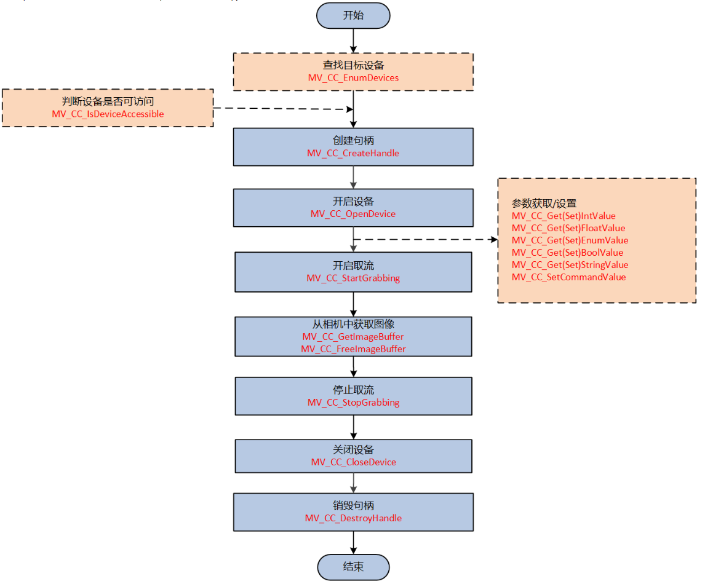

# 海康相机类
## 取流流程
**海康相机取流有两大类：主动取流和回调取流。**
### 主动取流

### 回调取流

回调取流是注册了自定义的回调函数后，缓存队列取到图像后会自动调用回调函数。

### 总结
流程可归纳为：
1. 选择相机
2. 判断相机是否可访问(可选)
3. 创建相机句柄
4. 开启相机
5. 参数设置
6. 注册回调函数(回调取流)
7. 开启取流
8. 取流(主动取流)
9. 停止取流
10. 关闭相机
11. 销毁句柄

## v1.0版本
## 开发流程
1. 用MVS设置好相机参数；
2. 调用Init()函数启动采图和图像处理线程；
3. 调用Close()关闭相机；
